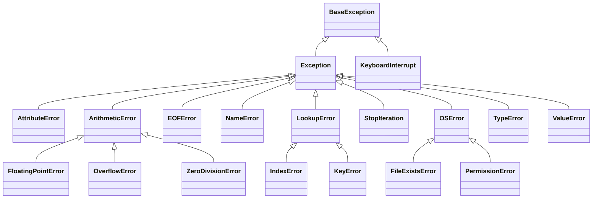

# Python for Data Science <picture> <source srcset="https://fonts.gstatic.com/s/e/notoemoji/latest/1f40d/512.webp" type="image/webp">  </picture>

> [!TIP]  
> Link to Previous Article  
> 🡸 [Handling Exceptions in Python: A Comprehensive Guide](/Exception%20Handling/Articles/70_handling_exceptions.md)

# Raising Exceptions in Python. Exception Hierarchy.

## 1. Introduction to Raising Exceptions

Raising exceptions is a fundamental part of handling errors in Python. By using exceptions, developers can signal that something went wrong and provide informative feedback to help fix the issue. This is particularly helpful in data science, where unpredictable data often requires careful error management.

## 2. The `raise` Statement in Python

In Python, we use the `raise` keyword to trigger an exception manually. It allows developers to interrupt the normal flow of a program and move to the exception handling mechanism. The `raise` statement can also carry specific messages that make it easier to understand the type and context of an error.

### Syntax of `raise`

```python
raise ExceptionType("Optional error message")
```

### Example

```python
def check_age(age):
    if age < 0:
        raise ValueError("Age cannot be negative.")
    return "Valid age"

# Trying to pass an invalid value
try:
    print(check_age(-5))
except ValueError as e:
    print(f"Error: {e}")
```

### Explanation

In the example above, if the input age is negative, a `ValueError` is raised with a custom error message. The `try-except` block catches this error, allowing the program to respond to it instead of crashing.

## 3. Benefits and Use Cases of Raising Exceptions

### Why is it Useful?

1. **Improves Code Robustness**: By handling possible errors, you prevent your program from crashing unexpectedly.
2. **Provides Clearer Debugging Information**: Raising exceptions with meaningful messages makes it easier to locate and understand issues.
3. **Encourages Data Validation**: Raising exceptions in validation steps helps ensure only correct and expected data enters the core functionality of the program.

### Practical Considerations

Raising exceptions is especially useful when:
- **Validating User Input**: Checking for invalid values, types, or ranges.
- **Data Processing**: Ensuring the right data format is used before executing data transformations.
- **Customizing Error Messages**: Providing descriptive messages to help users understand and resolve issues.

## 4. Exception Hierarchy in Python

Python's exceptions are organized into a hierarchy, with `BaseException` as the root class. Here’s a brief description of the main types:

1. **BaseException**: The root of all exceptions.
2. **Exception**: A common base class for most error types.
3. **AttributeError**: Raised when an attribute reference or assignment fails.
4. **ArithmeticError**: Base class for numeric errors, including `FloatingPointError`, `OverflowError`, and `ZeroDivisionError`.
5. **LookupError**: Base class for errors involving lookups (e.g., `IndexError`, `KeyError`).
6. **FileNotFoundError**, **TypeError**, and other specific exceptions.

Understanding this hierarchy helps developers handle exceptions effectively, catching specific errors when necessary.

## 5. Mermaid Code for the Exception Hierarchy Diagram

Here is the Mermaid code based on the provided hierarchy image:



## 6. Examples, Edge Cases, and Practical Considerations

### Example: Raising Exceptions in Data Science

In a data science project, if a dataset is missing key columns, we can raise a `KeyError` to prevent the program from moving forward with incomplete data.

```python
def validate_dataset(data):
    required_columns = {"age", "income", "gender"}
    if not required_columns.issubset(data.columns):
        raise KeyError("Dataset is missing required columns.")
    return "Dataset is valid."

try:
    # Assume df is a DataFrame that lacks required columns
    validate_dataset(df)
except KeyError as e:
    print(f"Validation Error: {e}")
```

### Edge Cases

1. **Raising Exceptions in Loops**: Be cautious when using `raise` inside loops, as it will immediately terminate the loop.
2. **Re-Raising Exceptions**: Sometimes, handling an error and then re-raising it can provide more context.

### Handling Nested Exceptions

For complex data processing tasks, nested `try-except` blocks may be necessary. However, avoid excessive nesting, as it can make code hard to follow.

## Conclusion

Exception handling in Python is essential for building robust applications, especially in data science, where data quality and consistency are vital. By understanding the hierarchy of exceptions and using `raise` effectively, developers can prevent critical errors, ensure data integrity, and create user-friendly applications. Properly implemented, exception handling is a powerful tool for managing errors gracefully and ensuring that the application continues to function as expected.

> [!TIP]  
> Link to Next Article  
> 🡺 [Custom Exceptions : Benefits and Examples](/Exception%20Handling/Articles/72_custom_exceptions.md)