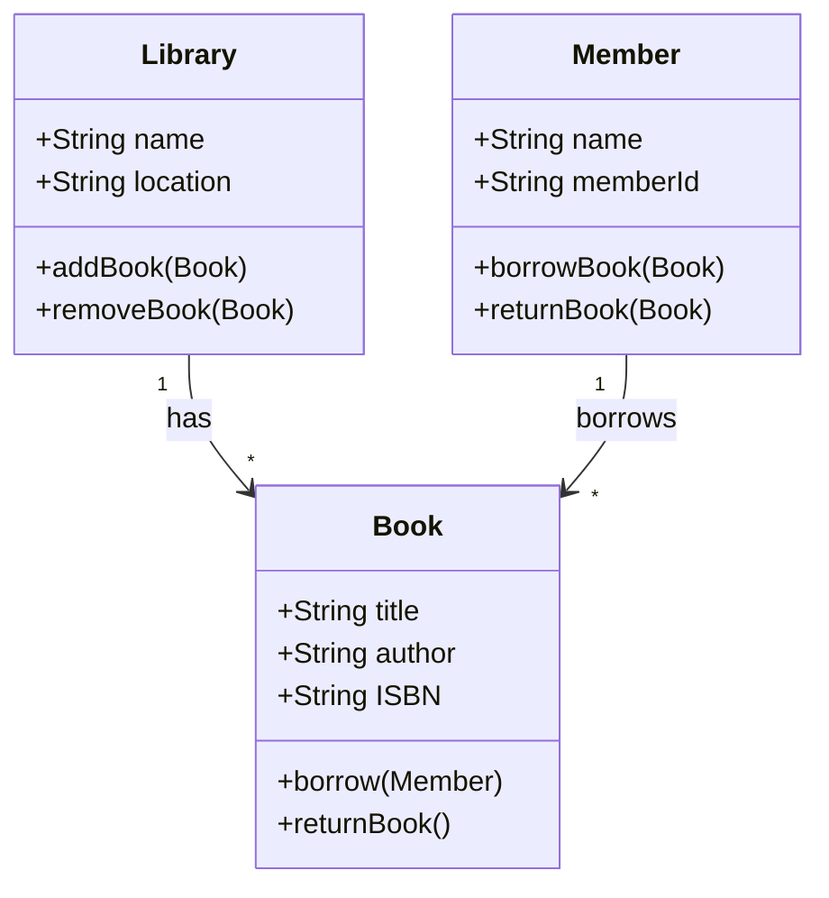

# Python for Data Science <picture> <source srcset="https://fonts.gstatic.com/s/e/notoemoji/latest/1f40d/512.webp" type="image/webp">  </picture>

> [!TIP]  
> Link to Previous Article  
> 🡸 [What are Magic Methods in Python?](/OOPs%20with%20Python/Articles/44_dunder_methods.md)

### What are Class Diagrams?

Class diagrams are a type of static structure diagram used in object-oriented programming and design to describe the structure of a system by showing its classes, attributes, methods, and the relationships among objects. They are a key component of the Unified Modeling Language (UML), which is widely used for modeling software systems.

### Components of Class Diagrams

1. **Classes**: Represent the blueprint of an object. A class is depicted as a rectangle divided into three parts:
   - The top section contains the class name.
   - The middle section lists the attributes (variables).
   - The bottom section contains the methods (functions) of the class.

2. **Attributes**: Represent the data members (variables) of a class. They describe the properties or characteristics of an object.

3. **Methods**: Represent the operations or functions that a class can perform.

4. **Relationships**: Show how classes are connected to one another. There are several types of relationships:
   - **Association**: A general connection between classes.
   - **Inheritance**: Depicts a parent-child relationship between classes.
   - **Aggregation**: Represents a whole-part relationship where the part can exist independently of the whole.
   - **Composition**: A stronger form of aggregation where the part cannot exist without the whole.
   - **Dependency**: A weaker form of relationship where one class uses another.

5. **Multiplicity**: Specifies the number of instances of one class that can be associated with one instance of another class.

### Notations in Class Diagrams

- **Class Notation**: Represented by a rectangle divided into three sections (name, attributes, methods).
- **Visibility Notation**:
  - **+**: Public
  - **-**: Private
  - **#**: Protected
  - **~**: Package (default)
- **Relationships**:
  - **Association**: Represented by a straight line connecting two classes.
  - **Inheritance (Generalization)**: Represented by a solid line with a hollow arrowhead pointing to the superclass.
  - **Aggregation**: Represented by a line with a diamond at the superclass end.
  - **Composition**: Similar to aggregation, but the diamond is filled.
  - **Dependency**: Represented by a dashed line with an open arrowhead.
- **Multiplicity Notation**: Numbers at the ends of association lines indicate how many instances of one class can be associated with one instance of another class (e.g., 1..*, 0..1).

### Example of a Class Diagram

Let's consider a simple class diagram representing a `Library` system. The diagram will include classes like `Library`, `Book`, and `Member`, along with their relationships.

#### Mermaid Code for Class Diagram

### Explanation

- The **Library** class has attributes `name` and `location`, and methods to `addBook` and `removeBook`.
- The **Book** class includes attributes like `title`, `author`, and `ISBN`, along with methods to `borrow` and `returnBook`.
- The **Member** class has `name` and `memberId` attributes and methods for borrowing and returning books.
- The diagram shows that a **Library** can have multiple **Books** (`1` to `*` relationship), and a **Member** can borrow multiple **Books** (`1` to `*` relationship).

### Important Points
- **Class diagrams** are essential for understanding and visualizing the architecture of an object-oriented system.
- **UML notation** is standardized, making it easier for teams to communicate designs.
- These diagrams can be used throughout the development process, from initial design to documentation.

This article provides a comprehensive look at class diagrams, which are fundamental to understanding object-oriented programming and design.

> [!IMPORTANT]  
> If you have studied Article 39-45, I would suggest you to perform some task so that you can check on your learning. Here is the link : [Task 7](/OOPs%20with%20Python/Tasks/task_7.ipynb)

> [!TIP]  
> Link to Next Article  
> 🡺 [Accessing Attributes of a Class Using Objects](/OOPs%20with%20Python/Articles/46_accessing_attributes.md)