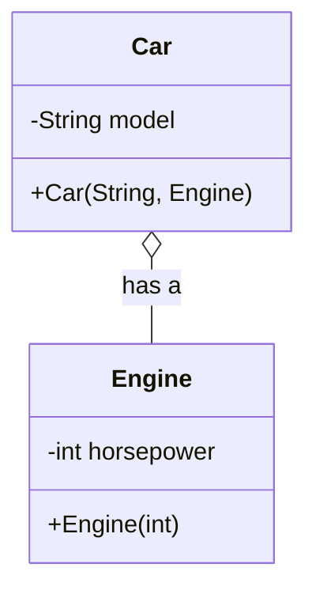
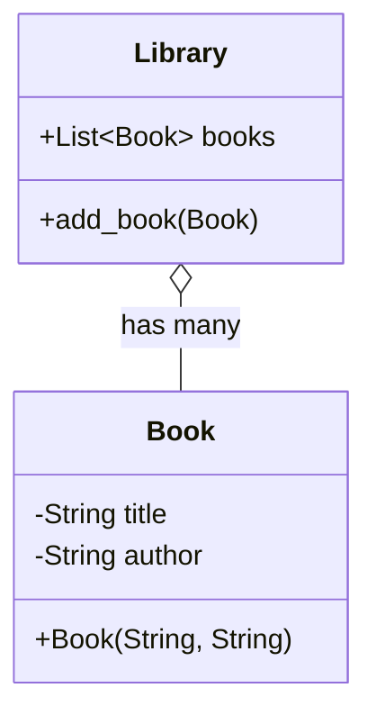

# Python for Data Science <picture> <source srcset="https://fonts.gstatic.com/s/e/notoemoji/latest/1f40d/512.webp" type="image/webp">  </picture>

> [!TIP]  
> Link to Previous Article  
> 🡸 [Class Relationships](/OOPs%20with%20Python/Articles/54_class_relationships.md)

## What is Aggregation?

**Aggregation** is a specific type of association relationship between two classes where one class (the whole) contains or owns another class (the part), but both can exist independently. This means that the lifecycle of the part is not tied to the whole. The "has-a" relationship in aggregation is represented by a hollow diamond in UML diagrams.

For example:
- A **Car** has an **Engine**, but the Engine can exist independently of the Car.
- A **Library** has many **Books**, but the Books can exist independently of the Library.

### Example 1: Car and Engine

In this example, the `Car` class aggregates the `Engine` class, meaning a car "has an" engine, but the engine can exist without the car.

```python
class Engine:
    def __init__(self, horsepower):
        self.horsepower = horsepower

class Car:
    def __init__(self, model, engine):
        self.model = model
        self.engine = engine

engine = Engine(150)
car = Car("Toyota", engine)
```

#### Mermaid Code for Class Diagram:



### Example 2: Library and Book

In this example, the `Library` class aggregates the `Book` class. A library "has many" books, but books can exist independently of the library.

```python
class Book:
    def __init__(self, title, author):
        self.title = title
        self.author = author

class Library:
    def __init__(self):
        self.books = []

    def add_book(self, book):
        self.books.append(book)

book1 = Book("1984", "George Orwell")
library = Library()
library.add_book(book1)
```

#### Mermaid Code for Class Diagram:



### Key Points of Aggregation

- **Independence**: The part (Engine or Book) can exist independently of the whole (Car or Library).
- **Representation**: In UML, aggregation is represented by a hollow diamond.
- **Use Case**: Aggregation is useful when you want to model relationships where the whole is composed of parts, but the parts can outlive the whole.

Understanding aggregation helps in designing modular and maintainable systems where components can be reused or exist independently.

> [!TIP]  
> Link to Next Article  
> 🡺 [What is Inheritance?](/OOPs%20with%20Python/Articles/56_inheritance.md)