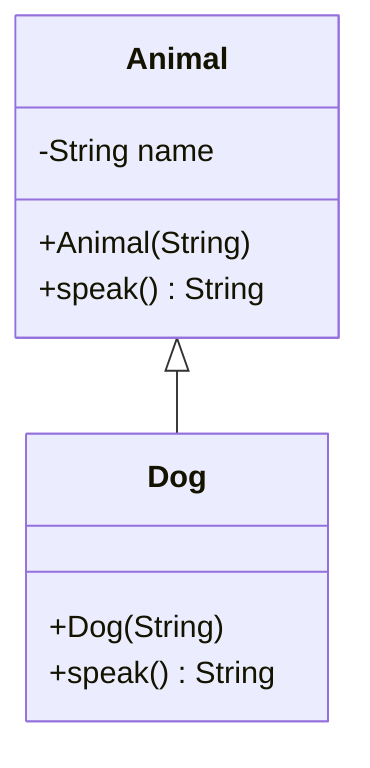

# Python for Data Science <picture> <source srcset="https://fonts.gstatic.com/s/e/notoemoji/latest/1f40d/512.webp" type="image/webp">  </picture>

> [!TIP]  
> Link to Previous Article  
> 🡸 [What is Aggregation?](/OOPs%20with%20Python/Articles/55_aggregation.md)

### What is Inheritance?

**Inheritance** is a fundamental concept in Object-Oriented Programming (OOP) that allows a class (known as the child or subclass) to inherit properties and behaviors (methods) from another class (known as the parent or superclass). This enables the reuse of code and helps in building a hierarchy of classes that share common traits.

Inheritance is particularly useful in situations where you have classes with similar functionality. By using inheritance, you can avoid code duplication and make your codebase more maintainable and extensible.

### How is Inheritance Implemented in Python?

In Python, inheritance is implemented by defining a new class that takes an existing class as its parent. The new class (child) will then inherit all the attributes and methods of the parent class. You can override or extend the inherited methods if needed.

#### Basic Syntax:

```python
class ParentClass:
    # Parent class code

class ChildClass(ParentClass):
    # Child class code
```

### Example of Inheritance:

```python
# Parent class
class Animal:
    def __init__(self, name):
        self.name = name

    def speak(self):
        return f"{self.name} makes a sound"

# Child class
class Dog(Animal):
    def speak(self):
        return f"{self.name} barks"

# Creating an object of the Dog class
dog = Dog("Buddy")
print(dog.speak())  # Output: Buddy barks
```

### What is Inherited in the Subclass?

When a class inherits from a parent class, the following elements are inherited by the subclass:

1. **Attributes**: All instance variables and class variables of the parent class other than private variables are inherited by the subclass.

2. **Methods**: All methods of the parent class other than the private methods are inherited by the subclass. The subclass can override these methods if needed.

3. **Class Variables**: If the parent class has class variables, they are also accessible in the subclass.

4. **Static Methods and Class Methods**: These are also inherited by the subclass.

5. **Constructors**: The constructor (`__init__` method) of the parent class is inherited by the subclass, but it can be overridden.

#### Example Showing Inheritance of Attributes and Methods:

```python
# Parent class
class Vehicle:
    wheels = 4  # Class variable

    def __init__(self, brand):
        self.brand = brand  # Instance variable

    def start(self):
        return f"{self.brand} is starting"

# Child class
class Car(Vehicle):
    def drive(self):
        return f"{self.brand} is driving"

# Creating an object of the Car class
car = Car("Toyota")
print(car.start())  # Inherited method: Output -> Toyota is starting
print(car.drive())  # Child method: Output -> Toyota is driving
print(Car.wheels)   # Inherited class variable: Output -> 4
```

### Mermaid Code for Class Diagram of Inheritance:



### Key Points on Inheritance:

- **Code Reusability**: Inheritance allows you to reuse existing code by creating a new class that inherits the functionality of an existing class.
  
- **Method Overriding**: Subclasses can override methods of the parent class to provide a specific implementation.

- **Multiple Inheritance**: Python supports multiple inheritance, allowing a class to inherit from multiple parent classes.

- **Accessing Parent Methods**: You can use the `super()` function in a subclass to call methods from the parent class.

### Important Considerations:

- **Diamond Problem**: In multiple inheritance scenarios, if the same method is inherited from multiple classes, Python uses the Method Resolution Order (MRO) to determine which method to call.

- **Inheritance vs. Composition**: While inheritance is powerful, it's essential to consider whether composition (where one class contains an object of another class) might be a better design choice, especially to avoid tightly coupling classes.

### Conclusion

Inheritance is a powerful tool in Python that allows developers to create a hierarchy of related classes, promoting code reuse and logical class structuring. It’s essential to understand its benefits and limitations to use it effectively in software design.

> [!TIP]  
> Link to Next Article  
> 🡺 [Types of Inheritance in Python](/OOPs%20with%20Python/Articles/56_inheritance.md)