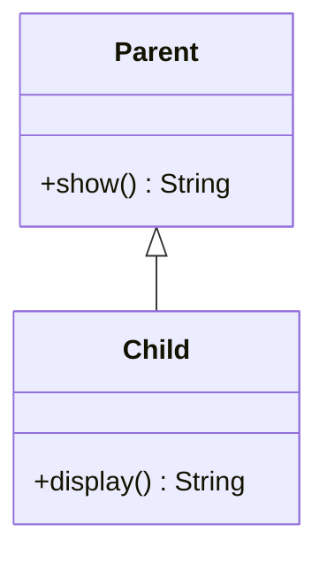
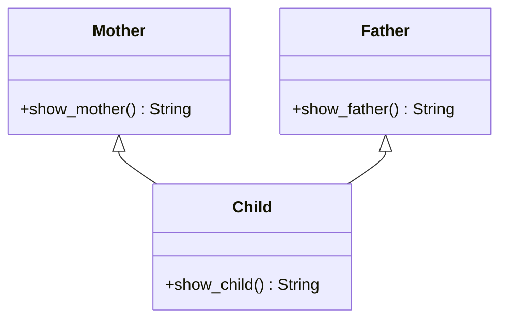
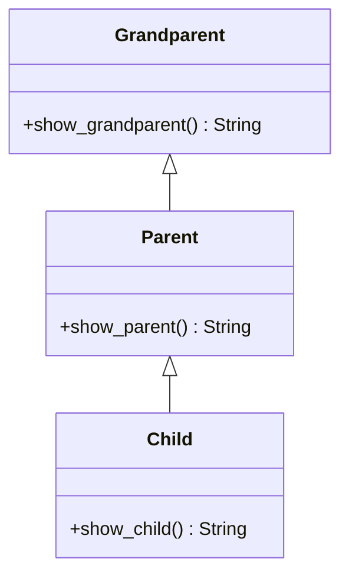
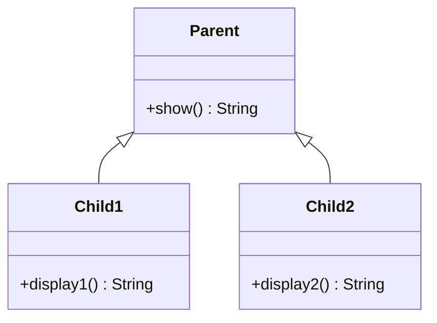
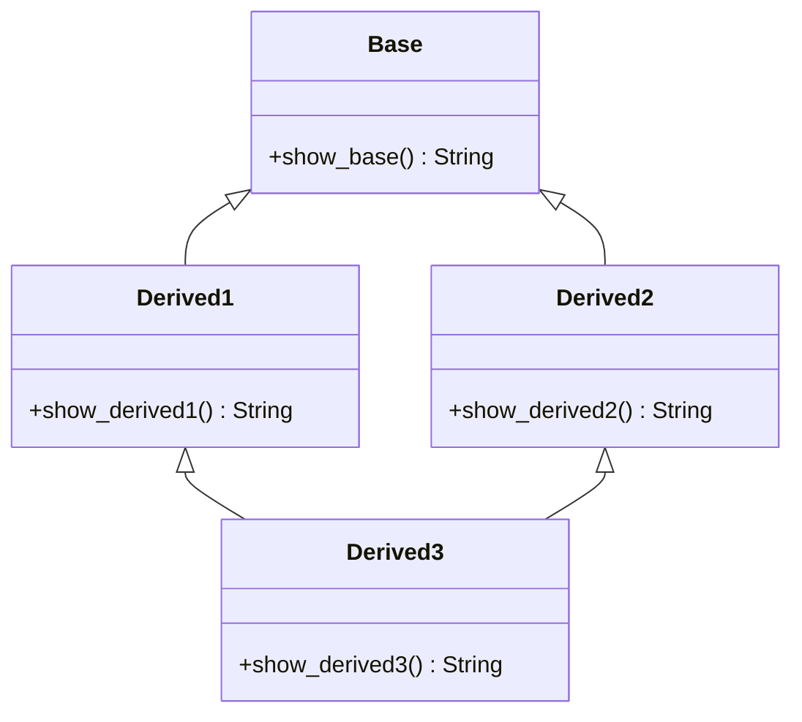

# Python for Data Science <picture> <source srcset="https://fonts.gstatic.com/s/e/notoemoji/latest/1f40d/512.webp" type="image/webp">  </picture>

> [!TIP]  
> Link to Previous Article  
> 🡸 [What is Aggregation?](/OOPs%20with%20Python/Articles/55_aggregation.md)

### Types of Inheritance in Python

Python supports several types of inheritance that allow classes to inherit properties and behaviors from one or more parent classes. These types include:

1. **Single Inheritance**
2. **Multiple Inheritance**
3. **Multilevel Inheritance**
4. **Hierarchical Inheritance**
5. **Hybrid Inheritance**

Each type serves different purposes in object-oriented programming and helps in organizing code more efficiently. Let's explore each one with examples and corresponding class diagrams.

---

### 1. Single Inheritance

**Definition:**  
In single inheritance, a subclass inherits from only one parent class. This is the most straightforward form of inheritance, where the child class derives the properties and behaviors of a single parent class.

**Example:**

```python
class Parent:
    def show(self):
        return "This is the Parent class"

class Child(Parent):
    def display(self):
        return "This is the Child class"

# Creating an object of Child class
child = Child()
print(child.show())    # Output: This is the Parent class
print(child.display()) # Output: This is the Child class
```

**Class Diagram:**



---

### 2. Multiple Inheritance

**Definition:**  
In multiple inheritance, a subclass can inherit from more than one parent class. Python supports this form of inheritance, allowing a class to have multiple parents and inherit attributes and methods from all of them.

**Example:**

```python
class Mother:
    def show_mother(self):
        return "This is Mother"

class Father:
    def show_father(self):
        return "This is Father"

class Child(Mother, Father):
    def show_child(self):
        return "This is Child"

# Creating an object of Child class
child = Child()
print(child.show_mother())  # Output: This is Mother
print(child.show_father())  # Output: This is Father
print(child.show_child())   # Output: This is Child
```

**Class Diagram:**



---

### 3. Multilevel Inheritance

**Definition:**  
In multilevel inheritance, a class is derived from another derived class, creating a chain of inheritance. The subclass at the bottom of the hierarchy inherits attributes and methods from all its ancestor classes.

**Example:**

```python
class Grandparent:
    def show_grandparent(self):
        return "This is Grandparent"

class Parent(Grandparent):
    def show_parent(self):
        return "This is Parent"

class Child(Parent):
    def show_child(self):
        return "This is Child"

# Creating an object of Child class
child = Child()
print(child.show_grandparent()) # Output: This is Grandparent
print(child.show_parent())      # Output: This is Parent
print(child.show_child())       # Output: This is Child
```

**Class Diagram:**



---

### 4. Hierarchical Inheritance

**Definition:**  
In hierarchical inheritance, multiple classes inherit from a single parent class. This allows multiple subclasses to share the attributes and methods of a common parent class.

**Example:**

```python
class Parent:
    def show(self):
        return "This is the Parent class"

class Child1(Parent):
    def display1(self):
        return "This is Child1 class"

class Child2(Parent):
    def display2(self):
        return "This is Child2 class"

# Creating objects of Child classes
child1 = Child1()
child2 = Child2()

print(child1.show())    # Output: This is the Parent class
print(child2.show())    # Output: This is the Parent class
```

**Class Diagram:**



---

### 5. Hybrid Inheritance

**Definition:**  
Hybrid inheritance is a combination of two or more types of inheritance. It can involve a mix of single, multiple, multilevel, or hierarchical inheritance patterns.

**Example:**

```python
class Base:
    def show_base(self):
        return "This is Base class"

class Derived1(Base):
    def show_derived1(self):
        return "This is Derived1 class"

class Derived2(Base):
    def show_derived2(self):
        return "This is Derived2 class"

class Derived3(Derived1, Derived2):
    def show_derived3(self):
        return "This is Derived3 class"

# Creating an object of Derived3 class
derived3 = Derived3()

print(derived3.show_base())     # Output: This is Base class
print(derived3.show_derived1()) # Output: This is Derived1 class
print(derived3.show_derived2()) # Output: This is Derived2 class
print(derived3.show_derived3()) # Output: This is Derived3 class
```

**Class Diagram:**



---

### Conclusion

Inheritance in Python provides a powerful way to create a hierarchy of classes that share common functionality, promoting code reuse and making programs easier to maintain. By understanding the various types of inheritance—single, multiple, multilevel, hierarchical, and hybrid—you can choose the most appropriate structure for your program's needs. Each type has its own use cases and advantages, and understanding them can greatly improve your object-oriented programming skills in Python.

> [!TIP]  
> Link to Next Article  
> 🡺 [What is Method Overriding in Python?](/OOPs%20with%20Python/Articles/58_method_overriding.md)